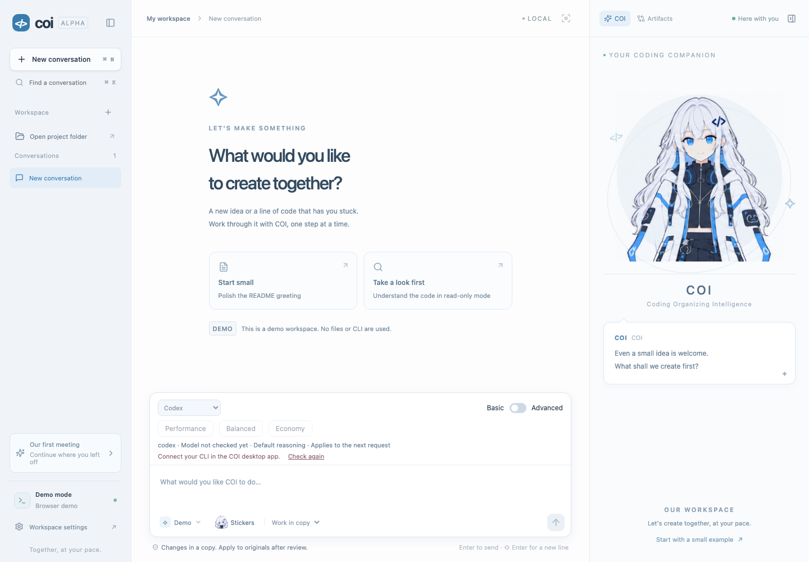

# COI

**Coding Organizing Intelligence** — a local coding workspace with a character companion.

[日本語](docs/README.ja.md) · [Support status](docs/STATUS.md) · [Contributing](CONTRIBUTING.md) · [Security](SECURITY.md)



**Development alpha · source distribution.** There is no signed installer release. Live CLI execution is enabled only for the validated OS, architecture, CLI version and execution profile listed in [the support matrix](docs/STATUS.md). Other configurations can use the browser demo; successful compilation does not imply live execution support.

## What it does

- Chat with COI on the left and your requests on the right. Six editable prompt stickers help you start a request without automatically sending it.
- Connect official Codex, Claude Code or Antigravity CLIs. Choose a model and effort, or use Performance, Balanced and Economy presets.
- Work in a copy, review a frozen diff, then explicitly apply it to the original. Undo preserves subsequent user edits by refusing conflicting recovery.
- Read staged and working-tree Git changes. Search and restore local conversations; use Focus mode, reduced motion and high contrast.
- English by default, with Japanese available in onboarding and **Workspace settings → Appearance & accessibility → Language**. Korean translation sources remain preserved but are not offered in the UI. User text and files are never translated automatically.

The companion uses PixiJS with complete-pose images and bounded mesh motion. It is not a Cubism Live2D model.

## Start with the demo

Install Node.js **22** and npm, then:

```sh
git clone https://github.com/coipod/coi.git
cd coi
npm ci --legacy-peer-deps
npm run dev
```

Open `http://127.0.0.1:1420`. The demo uses synthetic, in-memory examples: it does not invoke a CLI, send requests to an AI provider or modify project files. Demo verification results are simulated.

The repository is currently private during release preparation; cloning requires organization access.

## Build the desktop app

Use Rust **1.93.1** and the [Tauri platform prerequisites](https://v2.tauri.app/start/prerequisites/). macOS needs Xcode Command Line Tools; Windows needs MSVC Build Tools and WebView2.

```sh
npm run desktop
# Or build a local, unsigned macOS application:
npm run desktop:build -- --debug --bundles app
```

Stop `npm run dev` before starting `npm run desktop`: both use port 1420. The macOS result is `apps/desktop/src-tauri/target/debug/bundle/macos/COI.app`. Open it through Finder for normal user-session environment inheritance. No CLI binary is bundled.

For Windows build checks, run `npm run desktop:build -- --debug --bundles nsis` on Windows. Windows and Intel live CLI execution are not validated or enabled.

## Connect an AI provider

Open **Workspace settings → AI engines → Setup guide → Install and connect**. Existing installations are reused where supported; complete account authentication in the provider's official browser or CLI. Never paste credentials into COI. The setup recipes verify downloaded installers/packages and stop if their integrity changes.

Connecting Claude or Antigravity can send a short real verification request and consume provider usage. Real tasks may send your request and working-copy contents to the selected provider. Antigravity can load existing MCP servers; its additional-approval tool requests are denied. See the support matrix for each provider's restrictions.

Choose **Open project folder**, select a supported CLI/model, and submit a request. Review the native execution-scope dialog. Changes to originals require a separate diff review and explicit application.

## Data and boundaries

COI has no account server, billing service, automatic remote synchronization or telemetry. Provider accounts and charges are separate. Data stays in the OS app-data directory for `dev.coi.desktop` (SQLite, task copies and recovery journals); the browser demo uses localStorage. Local storage is not an encrypted vault.

Copies exclude credentials/configuration patterns, `.git`, `.env*`, dependencies, build output and ignored files. Symlinks/junctions are not followed. Limits: 10,000 files, 200 MiB total, 20 MiB per file. Secret filtering is not a guarantee that arbitrary secrets cannot exist in a project.

Apply verifies baseline hashes before writing and journals per-file replacements. Undo checks postimages; neither operation uses `git reset` or `checkout`. Only UTF-8 text creation/editing is automatically applied in this alpha. Deletions, renames and binaries are not. Multi-file writes are not one atomic filesystem transaction; interrupted operations require recovery.

Deleting a conversation does not delete originals or working copies. Copy deletion is separately confirmed. Optional 30-day cleanup protects unapplied changes and incomplete recovery records. Diagnostics are explicitly requested metadata, never automatic raw CLI-log uploads.

## Development checks

```sh
npm run check
npx playwright install chromium
npm run test:e2e
npm run test:native
cargo fmt --manifest-path apps/desktop/src-tauri/Cargo.toml --check
cargo clippy --manifest-path apps/desktop/src-tauri/Cargo.toml --all-targets -- -D warnings
node scripts/secret-scan.mjs --tracked
npm audit --audit-level=moderate
```

CI also runs Gitleaks and cargo-audit. Authenticated provider acceptance tests are ignored by default and must never run in public PR CI. See [Contributing](CONTRIBUTING.md) for the structure and contribution workflow.

## Licenses

Original code and documentation: [Apache-2.0](LICENSE). COI character art, icons, stickers and their derived images: [CC BY 4.0](assets/coi/LICENSE), with [attribution and provenance](assets/coi/README.md). Third-party software retains its own licenses; see [THIRD_PARTY_NOTICES](THIRD_PARTY_NOTICES.md). Do not imply that a fork is an official COI release.
