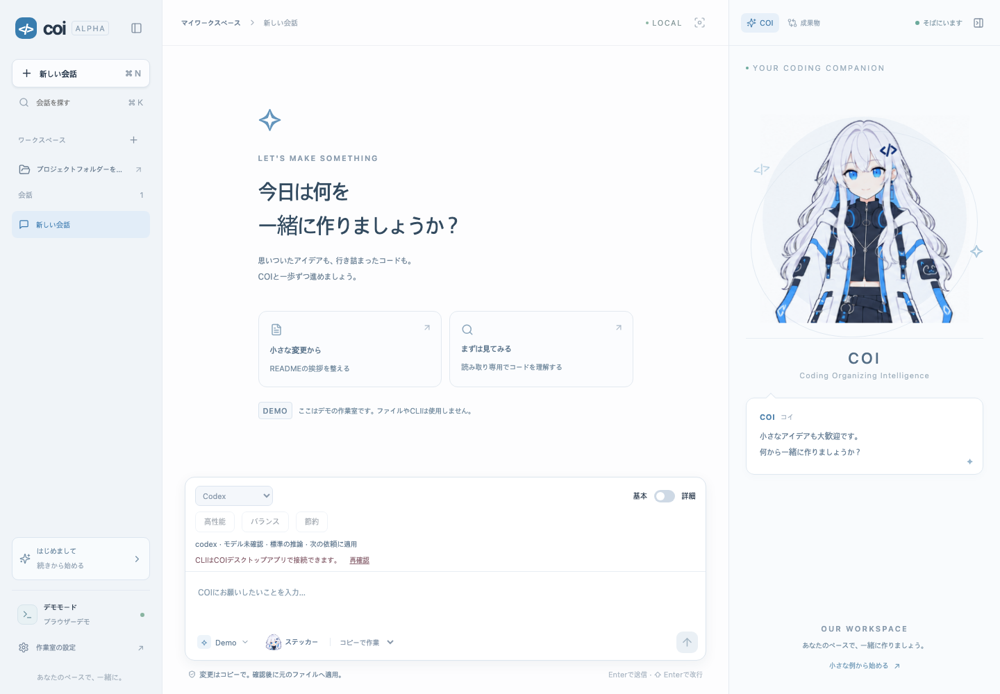

# COI — ローカルのコーディング作業室

[English](../README.md) · [対応状況](STATUS.md)

COIはキャラクターと一緒にコードの作成・確認を進めるデスクトップアプリです。英語が標準で、初回ガイドまたは **Workspace settings → Appearance & accessibility → Language** から日本語を選べます。



## はじめる

現在はソース配布の開発アルファです。公開準備中のため、リポジトリの取得には組織へのアクセス権が必要です。署名済みインストーラーは配布していません。

Node.js 22をインストールし、次を実行します。

```sh
git clone https://github.com/coipod/coi.git
cd coi
npm ci --legacy-peer-deps
npm run dev
```

`http://127.0.0.1:1420` を開くとデモを体験できます。デモは実際のCLI・AI・プロジェクトファイルを使いません。検証結果も模擬です。

デスクトップ版にはRust 1.93.1と[Tauriの前提条件](https://v2.tauri.app/start/prerequisites/)が必要です。`npm run dev`を止めてから`npm run desktop`を実行してください。macOSのローカルビルドは `npm run desktop:build -- --debug --bundles app` です。

## 実際の作業

設定のAIエンジンから公式CLIをインストール・接続し、公式画面でログインします。COIに認証情報を入力しないでください。接続確認や実際の作業ではAI提供元の利用量が発生する場合があります。

現在、実行を検証したのは対応表にあるmacOS Apple SiliconとCLIバージョンの組み合わせです。Windows・Intelのビルド成功は実行の対応を意味しません。

変更は作業コピーで行い、差分を確認してから元のファイルに適用します。後から編集されたファイルは自動で上書き・復元しません。ステッカーは依頼文を入力するだけで、自動実行しません。

会話・設定・作業コピーはローカル保存です。COIのアカウントサーバー、課金、遠隔追跡、自動アップロードはありません。実際のCLIはコードや依頼をAI提供元に送信する場合があります。詳しい制約・開発手順は英語READMEをご確認ください。

## ライセンスと貢献

コード・文書はApache-2.0、COIのキャラクター・アイコン・ステッカーはCC BY 4.0です。[出典表記](../assets/coi/README.md)と[貢献ガイド](../CONTRIBUTING.md)をご確認ください。利用者が書いた会話やファイルは言語設定を変えても保持します。
